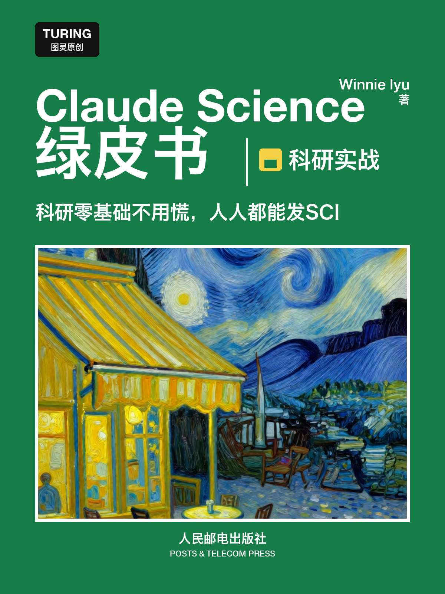

# Claude Science: The Green Book · Research in Action

**English** | [中文版 README](README_zh.md)

> Zero research background? No panic. A hands-on manual for running the full academic pipeline — topic → literature → writing → review → submission — with Claude Code.

## Who this book is for

1. **Grad students starting from zero** — no idea where to begin
2. **Practitioners outside academia** — doctors, engineers, teachers with data but no paper-writing experience
3. **Experienced authors** — who want to hand the mechanical work to AI

## Why this book

Not theory. Every method here comes from a real SCI paper's full journey — **rejected, diagnosed, rewritten, and successfully resubmitted to an international journal** — plus a battle-tested toolchain of research skills (literature search, paper version control with git, simulated journal reviewers, citation format conversion, pre-submission checkups).

## Table of contents (v0.1, in progress)

- **Getting Started** §01-03: Why Claude for science / Setting up your research terminal / Map a field in 30 minutes
- **Core Skills** §04-06: Literature as an asset / Paper as code / Writing with recipes
- **Advanced** §07-09: Your private reviewer / Quality gates / The submission pipeline
- **In Action** §10-12: Full retrospective of a rejected-to-resubmitted SCI paper / A multi-agent research workshop / Package your method as a Skill

Full outline: [OUTLINE.md](OUTLINE.md) (Chinese).

## Honest boundary

AI does not fabricate data. This book automates the mechanical parts of research and industrializes the quality gates — it accelerates process, not misconduct. Fact-checking against primary sources is a non-skippable step.

## Status

🚧 Work in progress. Watch this repo for updates.

## License

CC BY-NC-SA 4.0

---

*Author: Winnie lyu · 2026*
