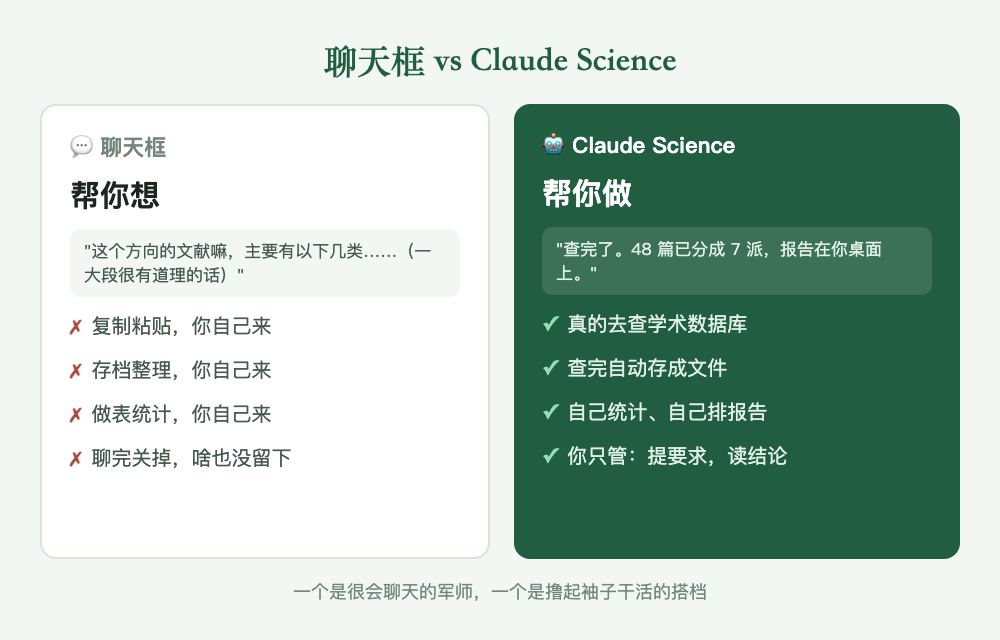
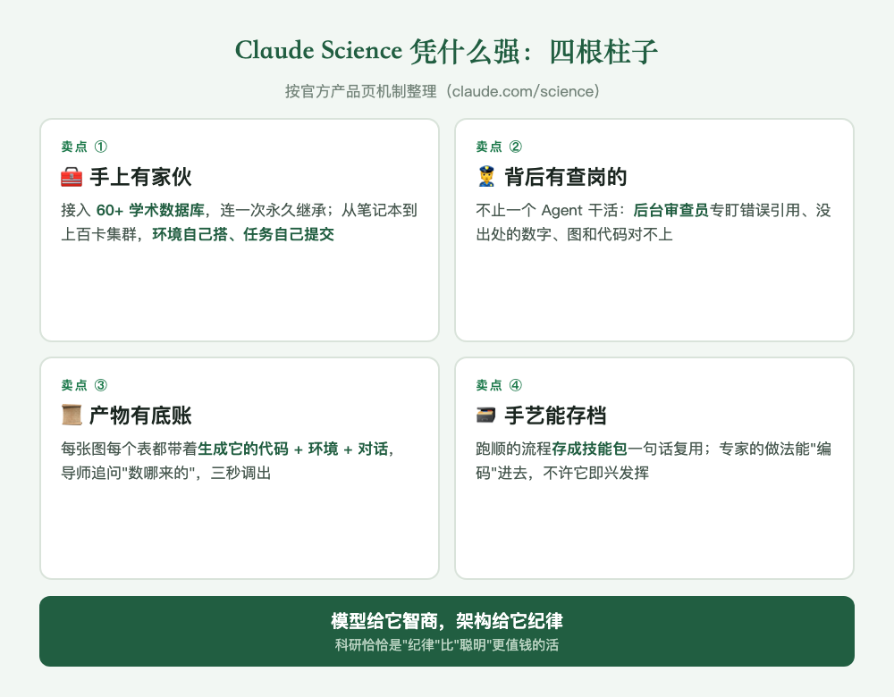
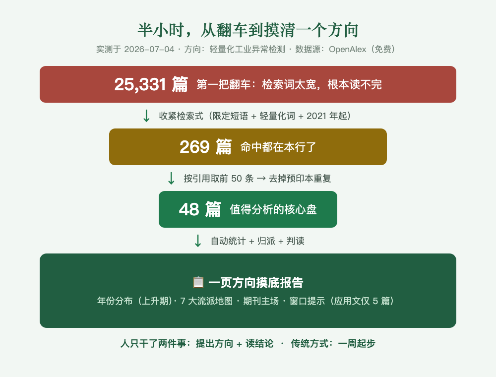

# Day 1 · 我给科研人找了个不睡觉的科研搭档

> 绿皮书连载 · 第 1 天 · 小驴同学
> 这个系列的目标就一句话：**帮你从零基础开始完成自己的课题，人人都能发 SCI。**
> 一天一更，记录用 AI 跑通「选题 → 文献 → 写作 → 投稿」的每一步，最后合并成一本开源的书：《Claude Science 绿皮书》。

## 一、先介绍一下这位搭档

我们实验室最勤奋的成员，不是哪位师兄，是住在我电脑里的一位。

它不用睡觉，不刷手机，凌晨三点让它查文献它也不会已读不回。查几十篇文献顺手做成统计表，改稿改到第八遍也不会跟你翻脸。这位搭档，叫 **Claude Science**。

说清楚它的底细：**它是 Anthropic（做 Claude 的那家公司）今年推出的官方科研产品**，入口在 claude.com/science。相当于官方给那个全世界程序员都在用的 Claude 做了一套科研特训：接入 60 多个学术数据库、每张图每个数字都留着"怎么算出来的"底账、还自带一个后台审查员专门盯错误引用。

先把我们的位置摆正：**这个工具不是我们做的，我们是教你把它用好的。** 就像教你用相机的人不必是相机厂：工具是人家的，怎么拍出好照片是我们天天在摸的。我们摸出来的手艺，这个系列全部免费开源。

它跟你手机里那些聊天 AI，差在一个本质的地方：

> **聊天框帮你想，Claude Science 帮你做。**

你在聊天框问"帮我查查这个方向的文献"，它回你一段头头是道的文字，然后呢？复制、存档、做表，还是你自己来，它就是个很会聊天的军师。Claude Science 不一样，它有手：你说查文献，它真去调学术数据库，查完自己存成文件、自己统计、自己排成报告。你只干两件事：提要求，读结论。

文献检索、数据整理、格式转换、画图排版，这些不长脑子但吞掉你一半读研时间的活，从今天起都是它的。

## 二、讲点专业的：它凭什么强

光说它勤奋像在夸小学生。拆开看，Claude Science 的强不靠"模型更聪明"这一件事，靠的是围着科研搭的一整套架构，四根柱子。别嫌抽象，第五节的真实案例里每一根都会出场：

1. **手上有家伙**：接入 60 多个学术数据库，连一次以后每次开工自动继承；从你的笔记本到实验室服务器再到上百张卡的集群，环境它自己搭、任务它自己提交管理
2. **背后有查岗的**：干活的不是一个 Agent。你这边推进，一个"后台审查员"Agent 在暗处盯：引用是不是真的、数字有没有出处、图跟生成它的代码对不对得上
3. **每个产物有底账**：每张图每个表都带着"怎么算出来的"完整档案（代码、环境、当时的对话），导师问"这数哪来的"，三秒调出来
4. **手艺能存档**：跑顺的流程存成"技能包"，下次一句话复用；行家的做法还能"编码"进去，让它按专家的路数干，不许即兴发挥

一句话：**模型给它智商，架构给它纪律。** 而科研这行，纪律比聪明值钱。这四根柱子，后面的连载会一根一根拆给你看。

## 三、见面礼：先送它的第一门手艺

Claude Science 有个很妙的官方机制：干顺手的流程可以存成"技能包"，下次一句话调用。我们照这个思路攒了一套自己的手艺，今天开源天天在用的第一个：**paper-search 文献检索技能包**（配 Claude 的命令行端使用）。

装上它，你的搭档就会用 OpenAlex 干活。这是个免费开放的学术数据库，收录超过 2 亿篇论文。重点是四个"不用"：**不用 API key，不用翻墙，不用装第三方包，Windows 上不用改一行代码**。

三步到位：

1. 去文末的 GitHub 仓库下载 `skills/paper-search` 文件夹
2. 放到 `C:\Users\你的用户名\.claude\skills\` 下面（Mac 是 `~/.claude/skills/`）
3. 对它说一句："帮我查一下 XXX 方向的文献"

查出来的每篇带标题、年份、引用数、DOI、有没有免费 PDF。真数据库里拉的，不是它编的。

我们拿这个技能包实测摸过一个陌生方向：第一把检索词太宽，翻车捞回 25,331 篇；收紧之后半小时出了一页方向摸底报告。完整过程长这样，手把手教程后面单独写一篇：

## 四、丑话说在前面：这位搭档吃得很多

这段比推荐它本身还重要。

搭档不要工资，但要"饭钱"：它每替你干一件事，背后都在大量调用 AI 模型，模型按用量计费。官网订阅从每月 20 美元起步，重度档一个月一两百美元。

我们的真实体感更扎心：拿它干科研这种重活，一次读几十篇文献、反复改稿，**基础档一个认真干活的下午就可能碰到用量上限**，然后它就"下班"了，得等几个小时才回来。不是它偷懒，是它真干了太多活。

三条实在建议：

1. **先用基础档试水**，摸清自己的饭量再加钱
2. **让它干"值钱"的活**：一次省你几小时的文献综述、改稿，别拿它闲聊
3. 怎么把饭钱省下来，本身够写一篇，**后面专门讲**

## 五、实测：一份综述的开局，它自己跑完了

这不是产品页的演示，是我们拿自己的博士课题真跑的一单（2026-07-04，全程记录已存档）。丢给它一句话：给"工业缺陷生成"这个方向做一份研究综述。

接下来它自己干了这些事，人只在关键节点批了计划：

- **自己翻工具箱**：找到 OpenAlex 和 arXiv 两个文献连接器，又给自己装上"文献综述"和"图表风格"两个技能包（柱子①④，就这么用的）
- **把 18 篇种子文献逐条查成真实档案**：DOI、年份、引用数一个个核，顺手还挖出几篇 2026 年的最新工作
- **建成 25 篇语料库**：开 Python 环境整理出参考文献表，按流派归类，量化验证了"反向去瑕这个方向只有 1 篇"的空位
- **自己画图**：一张谱系时间线图、一张方法对照矩阵，直接可进论文的那种

【成果图1 · 谱系时间线图：待传】

【成果图2 · 方法对照矩阵：待传】

最值得说的是收尾那一幕。交付之前，它的**后台审稿人 Agent 把它自己抓了现行**：4 处引用把第一作者张冠李戴（arXiv 编号全对，就是作者姓氏错了，人眼基本查不出这种错），外加对照矩阵里两格文字跟色阶对不上。它回去翻原始语料，逐处改正，重新存档了两份产物。

柱子②"背后有查岗的"和柱子③"产物有底账"，说的就是这一幕。不是它不犯错，是它的架构默认它会犯错，并且抓得住。

连引用数它都留了个心眼：查到的引用数标注为"版本相关下界"，因为匹配到的常是 arXiv 预印本记录，正式版引用更高。这个严谨劲，说实话比不少人类作者强。

## 六、但是，有两个问题

写到这你可能想试了。先泼两盆冷水，都是我们自己撞过的：

**第一，对 Windows 用户不太友好。** 我们这套全程在 Mac 上跑通，可国内科研人的主力机大多是 Windows，装起来有门槛。

**第二，它真的能吃**，上面说了。

这两个问题不解决，"人人都能用 AI 做科研"就是句空话。所以明天 Day 2 就讲第一个：**怎么在 Windows 电脑上把这位搭档请回家。**

---

本系列一切素材（含实测原始数据和技能包）免费拿：**github.com/Dalaoyuan2020/claude-science-green-book**

> 一句带走：科研里最贵的是你的时间，不是搭档的饭钱。
