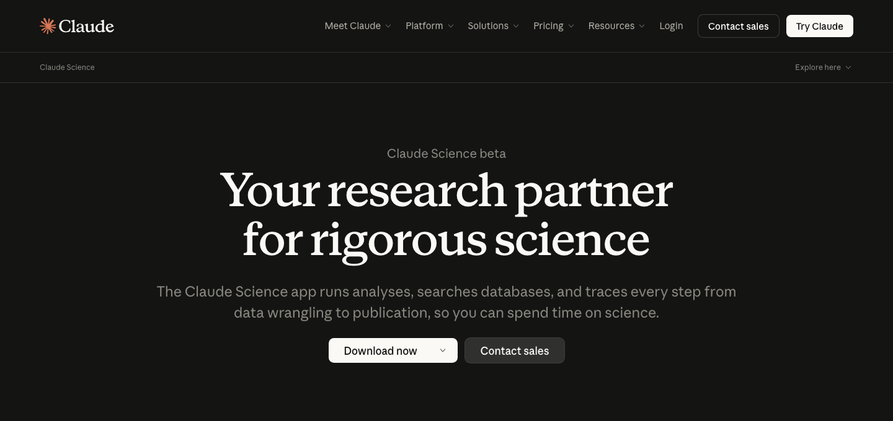
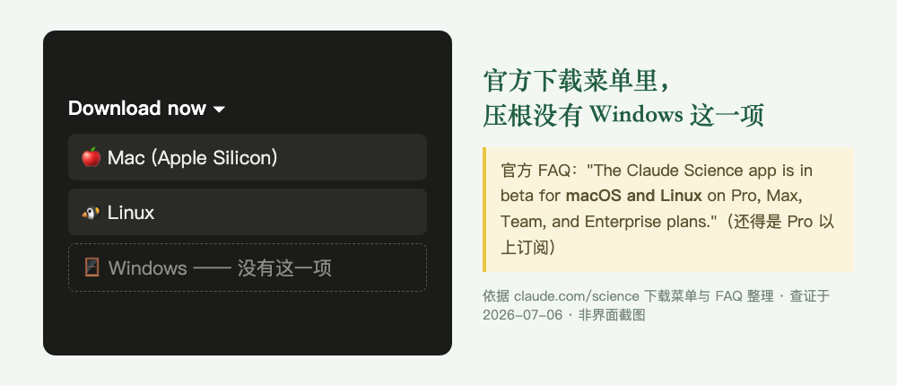
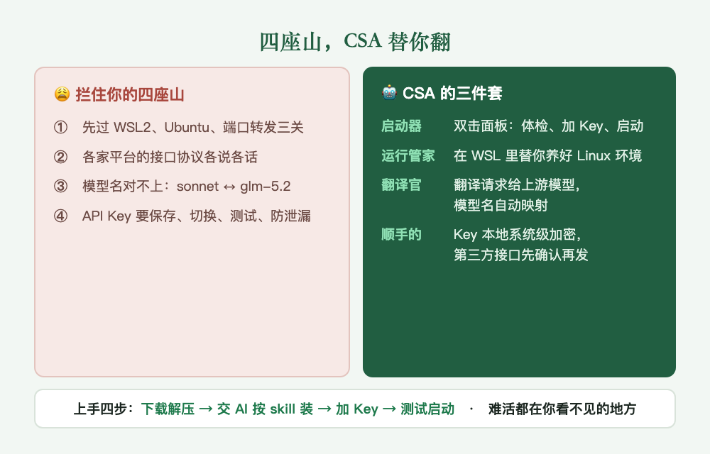

# Day 2 · Windows 用不了？我们做了个双击就能用的

> 绿皮书连载 · 第 2 天 · 河小驴
> 目标不变：**帮你从零基础开始完成自己的课题，人人都能发 SCI。**


昨天那篇发出去，后台立刻有人举手：搭档听着是好，可我这台是 Windows，装不了啊。

这声"装不了"我太熟了。你读完 Day 1，热血上头，打开 claude.com/science，找到那个大大的「Download now」点下去，傻眼了：只有 Mac 和 Linux。你不死心，去搜"Claude Science 怎么在 Windows 上跑"，一头扎进一堆天书：WSL2、装 Ubuntu、开虚拟化、配端口转发，PowerShell 里还蹦出一串红字报错。你是来做科研的，不是来当运维的，一晚上折腾下来，搭档没请进门，人先被劝退了。

今天这篇，就是来接你过这道坎的。先把话撂这儿：**我们做了个免费开源的小工具，叫 CSA，Windows 用户双击一个图标就能把 Claude Science 跑起来，顺带还能接上国产大模型省饭钱。** 怎么做到的，往下看。

## 一、先看清楚，你要请进门的是谁

别为了个装不上的东西死磕。先掂量清楚 Claude Science 值不值得你折腾，值，这也是我们肯花力气给它修桥的原因。



这是它的官网。再把昨天的定位钉一遍：**Claude Science 是 Anthropic（做 Claude 那家）的官方科研产品，不是我们做的，我们是教你把它用好的。** 它跟你手机里那些聊天 AI 差在一个根子上：聊天框帮你想，它帮你做。你说查文献，它真去调数据库、自己存档、自己统计成表；每张图每个数字都留着"怎么算出来的"底账；背后还蹲着一个审查员，专盯错引用。

Day 1 那个真事你可能还记得：给一个陌生方向写综述，它自己跑完检索、剔重、数空位、画图，临交稿还把自己 4 处"把作者姓氏张冠李戴"的引用揪出来改了，那种人眼根本查不出的错。这种活，才是你想把它请进门的理由。

## 二、可你想装它，第一步就卡死

官网那个「Download now」点开，就是下面这样：



Mac、Linux，独独没有 Windows。而真正卡住你的，不止"少一个下载按钮"这么简单，是它背后横着四座山：

1. **它是给 Linux 生的。** Windows 上你得先装一层叫 WSL2 的"系统里的系统"，再往里塞个 Ubuntu，再配端口转发，每个词都够你搜半小时
2. **接口各说各话。** 国产模型、聚合平台、第三方接口服务，协议五花八门，接一个是一个的脾气
3. **名字对不上。** Claude 那头喊 sonnet、opus、haiku，国产这头叫 glm-5.2、deepseek-v4-pro，中间没人翻译就对不上号
4. **Key 一堆还烫手。** 好几个平台的 API Key 要存、要切、要测，还不能手滑泄漏在日志和截图里

每座山对程序员是半小时的事，对普通科研人就是一堵墙。会卡住你的从来不是"不会写 Prompt"，是第一步就被环境糊一脸。

## 三、CSA 怎么解：麻烦都发生在你看不见的地方

CSA（Claude Science Assistant）不是新的大模型，也不玩任何灰色手段。它干的事就一句话：**上面那四座山，替你翻过去。** 拆开是三样：



- **你看到的**：一个双击就开的面板。体检电脑、加 Key、测连通、点启动，四个动作，都是点鼠标
- **你看不到的**：它在后台替你把 WSL、Ubuntu、运行时那一整套默默铺好；再架一个本地"翻译官"，把 Claude 发出的话，翻成上游模型听得懂的
- **最省心的**：自动模型映射。它扫一遍你接的平台有哪些模型，自动配好"主力活派给大模型、跑腿活派给便宜的快模型"，你点个确认就成

一句话记住它：**你只管点鼠标，脏活累活它在你看不见的地方干完了。**

还有个顺带的彩蛋。昨天临走，我提醒过你这搭档有两个坑：一是不支持 Windows，二是烧钱。头一个坑，这篇从头到尾都在替你填；第二个坑，CSA 也顺手帮你省下一大截。靠的就是上面那个"翻译官"：它让 CSA 能接的不只官方 API，GLM、LongCat、DeepSeek、MiniMax 都能官方直连，还支持 OpenCode Go、OpenRouter 这类聚合平台。价格你去官网自己比，我只撂一句：**贵的活留给官方 Claude，日常粗活扔给国产模型，一个月的饭钱立刻不是一个数量级。** 哪类活配哪档模型最划算，那张搭配表够写一整篇，连载后面单开一期。

## 四、上手：先让 AI 按 skill 装好，再用启动器跑

先把话说清楚，它**不是下下来双击就能用**。得分两段：先让一个 AI 编程助手，照仓库里内置的安装 skill 把底层环境装好；装完，才用启动器把搭档跑起来。脏活都是 AI 和 CSA 干。

**第一段，装。** 你只做三件事：

1. 打开 CSA 的 GitHub 仓库，首页 README 会一步步教你下载（认准这个官方仓库，群文件、网盘里的一律别碰）
2. 下下来解压到一个短路径，比如 `C:\CSA`（整个文件夹都要，别只拷那个 exe）
3. 把整个文件夹交给你的 AI 编程助手（Codex、Claude Code 都行），发下面这段，让它照仓库里的安装 skill 替你装：

```text
请你帮我在这台 Windows 电脑上安装并启动 CSA（Claude Science Assistant）。

请先阅读当前文件夹里的 README.md、docs/quick-start.zh-CN.md，以及安装 skill：skills/bootstrap-claude-science-wsl/SKILL.md。

要求：
1. 先只读体检和预览，不要安装、删除、重启或修改系统
2. 判断这台电脑是否已有可用 WSL/Ubuntu，把将要做的事说给我听，我确认后再动手
3. 不要修改系统网络设置（DNS、hosts、代理、证书一概不动）
4. 不要输出、保存或截图我的 API Key
5. 装完打开 claude-science-assistant.exe，指导我添加 API Key、测试连通、自动映射模型
6. 如果失败，生成脱敏的诊断摘要，告诉我卡在哪一步
```

眼熟吗？跟昨天那个综述模板一个思路：**先立规矩，再干活。** 只读体检、不乱动系统、不碰你的 Key。AI 助手能帮你到什么程度，是你喂给它的规矩决定的。

**第二段，用。** AI 把底层装好了，才轮到启动器登场：打开面板，加 Key → 测试 → 自动映射 → 启动，四下点完，搭档就在你的 Windows 上活过来了。

## 五、注意事项

- 第三方接口服务，CSA **不默认信任**，会让你亲手确认域名之后，才肯把 Key 发过去。这是特性，不是麻烦
- 你的 API Key 用 Windows 系统级加密（DPAPI）锁在本地，别人把整个文件夹拷走，也带不走你的 Key
- v0.1.1 是第一个公开版，坑肯定有。README 里备了自动脱敏的诊断脚本和答疑入口，卡住了别一个人硬撞，把脱敏摘要甩进来就行


装好这一刻起，那些熬夜跑流程、半夜盯进度的活，它接手了。你躺沙发上用手机点两下，剩下的它在那头替你干。

## 装好之后，干什么？

明天 Day 3，带你干第一票真活：**30 分钟摸清一个研究方向。** 就是 Day 1 案例里那套查文献、画流派地图、数空位的活，这回手把手，带你在自己的方向上从头跑一遍。

搭档已经请进门了，是时候让它下地干活了。

---

CSA 仓库：**github.com/Dalaoyuan2020/claude-science-assistant**
绿皮书仓库：**github.com/Dalaoyuan2020/claude-science-green-book**

> 一句带走：真正难的从来不是装工具，是别让"装工具"这一步，把你挡在科研的门外。
