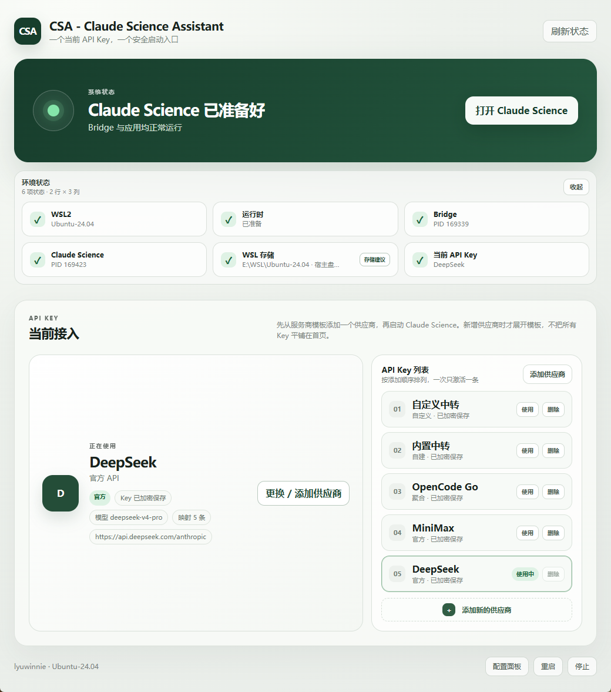
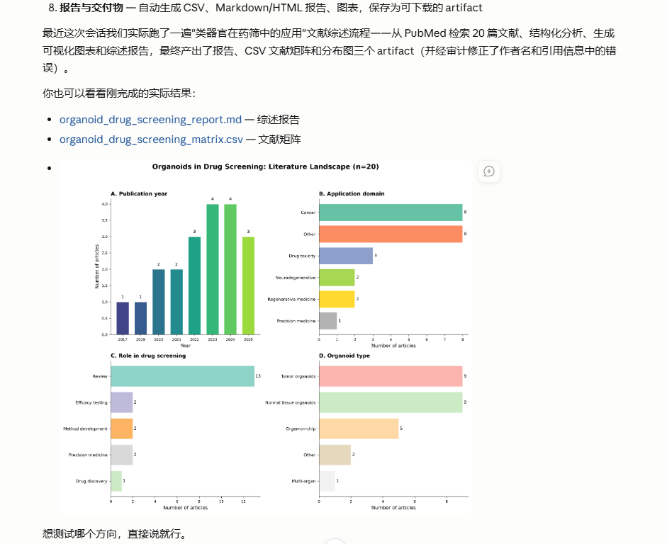
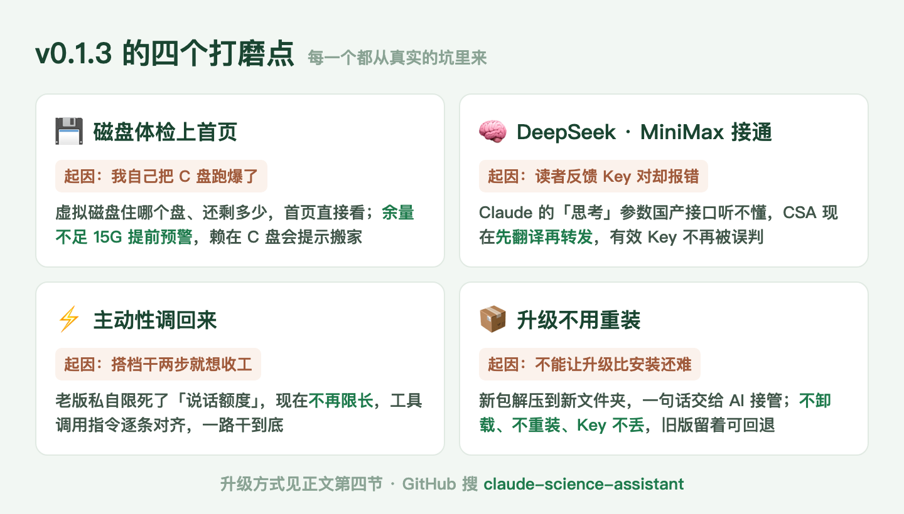

# Day 3 · 我把自己的 C 盘跑爆了，然后有了这次更新

> 绿皮书连载 · 第 3 天 · 河小驴
> 目标不变：**帮你从零基础开始完成自己的课题，人人都能发 SCI。**


先跟等着「30 分钟摸清一个研究方向」的朋友说声抱歉，那期不会鸽，往后挪一挪。因为过去这几天，我们干了一件更要紧的事：把 CSA 从「能跑通」磨到了「真的可用」。

工具没磨利就带你下地，坑的还是你。所以今天插播一期，讲讲 v0.1.3 这次更新，和它背后几个狼狈的故事。

## 一、周三凌晨，我的 C 盘满了

CSA 发布之后，我自己就是它的头号用户，天天拿它跑真实验。周三凌晨那次，实验跑到一半，Windows 右下角弹出红色警告：磁盘空间不足。紧接着整台电脑卡成幻灯片，鼠标都拖不动。

查了半天才明白怎么回事。CSA 的底层环境住在一个叫 WSL 的「系统里的系统」里，它所有的文件其实都塞在一个虚拟磁盘文件里。这个文件有个脾气：**只会越长越大，默认还赖在 C 盘。** 你在里面跑实验、下数据集，它就在你看不见的地方一口一口把 C 盘吃光。等你发现，系统盘已经见底了。

我的解法是把整个虚拟磁盘搬去了空间宽裕的 E 盘，电脑立刻活过来。但这事让我后背发凉：我懂点原理，还折腾了半宿；换成一个刚装好 CSA 的科研人，大概率对着卡死的电脑干瞪眼，还以为是自己装坏了。

**自己踩过的坑，不能让你再踩一遍。** 所以 v0.1.3 把「磁盘体检」直接做上了首页：



新界面上那格「WSL 存储」，就是这么来的。它盯着三个数：虚拟磁盘住在哪个盘、那个盘还剩多少、里面的 Linux 系统还剩多少。**任何一头余量掉到 15G 以下，提前给你亮警告**；发现它赖在 C 盘，直接提示你该搬家了。要是磁盘已经出了毛病，它还会拦住那些会把事情搞得更糟的操作。

顺带，整个首页也重排了：WSL、运行时、Bridge、Claude Science、存储、当前 Key，六项状态两行摆齐，哪里不对一眼看到，不用再猜。

## 二、后台喊得最响的一句：DeepSeek 连不上

第二个故事不是我的，是读者的。Day 2 发出去之后，后台反馈里喊得最响的就是这句：**DeepSeek 接不上，MiniMax 也不行，Key 明明是对的，一测就报错。**

我们顺着报错挖下去，发现冤情了：Key 真没问题。问题出在「方言」上。Claude 说话时会带一些自家的「思考」参数，DeepSeek 和 MiniMax 的接口听不懂这个说法，直接把整句话打回来。CSA 一看被打回，就误以为你的 Key 是坏的。

v0.1.3 给这两家各配了个贴身翻译：Claude 的说法进来，先翻成对方听得懂的再送出去。修完我们没敢只在自己机器上说好，拿真实请求从头到尾跑了一遍：DeepSeek 一句一句回话的流式模式、一次给全的普通模式，全部通过；MiniMax 也已经接通对话。**现在把 DeepSeek 或 MiniMax 的 Key 填进去，添加、测试、映射、开跑，一条道走到黑。**

## 三、它怎么变「懒」了？

第三个问题最隐蔽，是我自己用出来的。最早我用官方订阅版时，这搭档非常主动：你说查文献，它自己把检索、存档、统计、画图一路干到底。可切到 API 接入之后，它就变得畏畏缩缩：干两步就停，回答短得敷衍，图也懒得画了。**同一个模型，两副面孔。**

这个对比把根因暴露了：模型没变笨，是 CSA 自己坑了它。订阅版的请求不经过 CSA 转发，所以生龙活虎；而老版本 CSA 转发请求时，会顺手给模型限死一个不大的「说话额度」。模型一开口就快到额度上限，自然长话短说、能省则省，看起来就懒了。

v0.1.3 把这个私自设限撤了：**上游模型能说多长就说多长，该调用工具就放手调用。** Claude 那套「哪个工具、什么时候用」的指令，也逐条对齐翻译到位。装回去再跑同样的活，那个一路干到底的搭档回来了：



这是修完之后的一次真实会话：一句话下去，它自己跑完 PubMed 检索 20 篇文献、做结构化分析、画出四联分布图，最后交出综述报告和文献矩阵两个成品文件，交稿前还把作者名、引用信息里的错误自己审计修正了。这才是你该拿到的搭档。

## 四、升级：还是一句话丢给 AI

前面三个故事，都是靠大家升级才能吃到的。所以这次把升级本身也磨了一遍，立了三条规矩：**不卸载、不重装、Key 不丢。**

老版本不用删。你只做三件事：

1. 去 GitHub 仓库的 Releases 页，下载 v0.1.3 的**完整压缩包**（别只下那个 exe，更新的不止它一个）
2. 解压到一个**新文件夹**，别覆盖旧的
3. 把新文件夹交给你的 AI 编程助手（Codex、Claude Code 都行），发下面这段：

```text
请协助我在这台 Windows 电脑上安装或升级 CSA。当前文件夹是我刚解压的新版完整包。

要求：
1. 先读 README.md 和 docs/prompts/ 里的安装升级说明
2. 只做只读体检，判断我是首次安装还是老版升级，把计划讲给我听，我确认后再动手
3. 升级时不卸载 WSL，不清空设置，不动我已保存的 API Key
4. 旧版文件夹先留着，万一不顺利可以退回去
5. 装完做一次连通测试和一次真实对话，确认没问题才算完
```

眼熟吗？还是那个思路：**先立规矩，再干活。** AI 会先体检你的电脑，判断你是新装还是升级，把计划说给你听，点头了才动手。新版接管后旧版还留着，等你亲手确认一切正常，再删不迟。首次安装的朋友更省事，同一段话，AI 自己会分流。



## 五、注意事项

- 界面上那个「辅助迁移」按钮，目前只帮你体检磁盘、生成一份给 AI 的搬家计划，**它自己不动你的 WSL**。真要搬家，拿着计划让 AI 陪你做，别指望一键
- MiniMax 目前确认的是接得通、聊得动；超长输出和复杂工具调用我们还在补测，重活先派给 DeepSeek 或 GLM 更稳
- 下载认准 GitHub 官方仓库的 Releases 页，压缩包旁边配了校验文件，群文件、网盘里的一律别碰


## 磨完这一轮，该下地了

工具磨利了，欠的活该还了。下一期就带你干那票真活，另外再教一个省钱狠招：**有个 5 美元一个月的套餐，接进 CSA 之后性能意外地能打。** 具体怎么订、怎么配，下期见。

---

CSA 仓库：**github.com/Dalaoyuan2020/claude-science-assistant**
绿皮书仓库：**github.com/Dalaoyuan2020/claude-science-green-book**

> 一句带走：好用的工具从来不是发布出来的，是一轮一轮打磨出来的。
