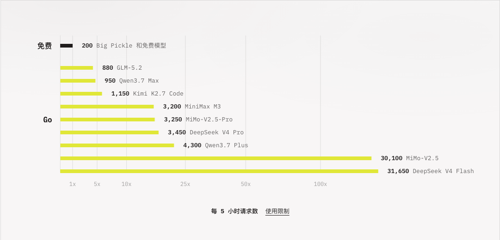
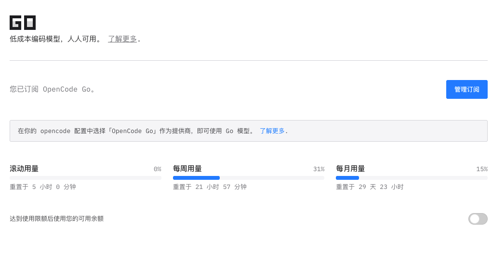
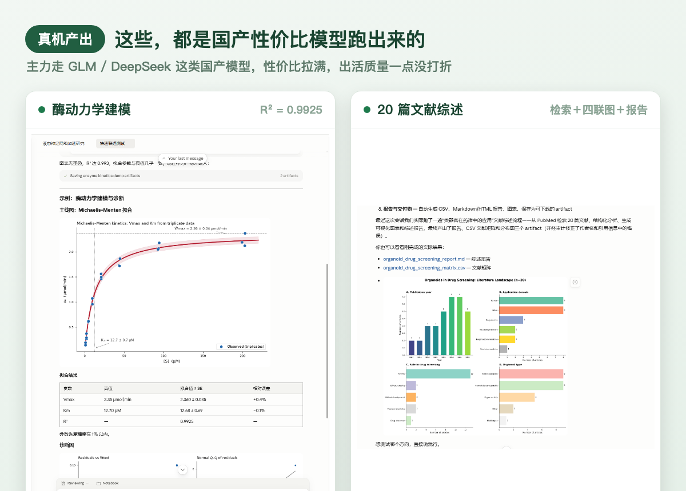

# Day 4 · 我做这一切，就是想让你一天花一块二用上它

> 绿皮书连载 · 第 4 天 · 河小驴
> 目标不变：**帮你从零基础开始完成自己的课题，人人都能发 SCI。**


前三天我一直在铺路。Day 2 做了个 CSA，帮 Windows 用户把 Claude Science 跑起来；Day 3 又把它磨到「真的可用」。可这两篇都绕开了一个最现实的问题：**钱**。

说句掏心窝的话。我折腾这一整套东西，从一开始就冲着一件事去：**让做科研的普通人，一天花一块二，就能用上一个能真干活的 AI 搭档。** 官方那套按量计费，跑几个大实验就是几十上百块，学生党根本扛不住。今天这篇，就把我自己在用、也觉得目前最划算的那个法子，原原本本交给你。

## 一、目前最划算的：OpenCode Go

先把结论撂这儿：**如果你手头没有便宜的模型，我强烈推荐 OpenCode Go。** 用官方自己的话说，它就是「低成本编码模型，人人可用」。说得再清楚点：OpenCode 是个干编程活的 AI 工具，Go 是它推出的低价模型订阅。一个订阅，一大把强模型随便调，还能直接接进我们的 CSA。

价格是它最狠的地方：

- **首月 5 折，约 5 美元（¥35 出头）**：折下来一天一块二，比一瓶水便宜
- **次月起每月约 10 美元（¥70 出头）**：一天两块出头

我知道有人会问：这么便宜，是不是模型很少、很弱？恰恰相反。它给你的是一整桌**国产性价比模型的自助餐**：



GLM-5.2、Qwen3.7、Kimi K2.7、MiniMax M3、MiMo-V2.5、DeepSeek V4……**清一色的国产强模型，性价比是它们共同的杀手锏**。而且每个模型每 5 小时给你的额度都不是意思意思：GLM-5.2 是 880 次，DeepSeek V4 Flash 更是三万多次。对一个每天写论文、跑分析的科研人来说，**这个量根本用不完。**

## 二、主力模型怎么选：GLM-5.2 打底

模型多是好事，但也容易挑花眼。我用下来给你一个最省心的建议：**主力就用 GLM-5.2。**

理由两个：一是它有足够的**思考深度**，写代码、理逻辑、跑分析都扛得住，不是那种只会闲聊的轻量模型；二是它在这一桌国产模型里**性价比拉得最满**，价格低、额度还给得足。日常科研的大部分活，它一个就包圆了。

那另外那些模型干嘛用？这就要说到 CSA 的绝活了：**模型映射**。OpenCode Go 给你四个映射位，你可以把不同的活派给不同的模型：主力活交给 GLM-5.2，需要长输出或特定强项时再切别的。CSA 会把 Claude 那套「主力/快速」的角色，自动对应到你配的这几个模型上，你点个确认就成。



订阅好之后，在 CSA（或 opencode 配置）里把提供商选成「OpenCode Go」，填上 Key，剩下的映射 CSA 替你配。滚动、每周、每月三档用量它都给你摆在明面上，花到哪一步一清二楚。

## 三、性价比高，不等于将就

我最怕你有个误会：国产性价比模型 = 出活打折。这一点，我用两张真实的成果直接堵上。



左边这套，是让它做酶动力学建模与诊断：一条 Michaelis-Menten 拟合曲线，**R² 高达 0.9925，Vmax、Km 两个关键参数的恢复误差都压在 1% 以内**，残差图、Q-Q 图一整套诊断全给你配齐。右边这套，是 Day 3 提过的那单 20 篇文献综述：它自己跑完 PubMed 检索、画出四联分布图、交出报告加文献矩阵，交稿前还把引用里的错误自己审计修正了。

关键在这儿：这两套活，主力跑的都是 **GLM、DeepSeek 这类国产性价比模型**，一天也就几块钱（左图左下角那行小字就写着 Opus 4.8 映射到 DeepSeek V4 Pro）。**省下来的是钱，不是活。**

## 四、上手：附我的邀请码，双方各返 5 刀

真要试，走我的邀请链接注册，**你和我各返 5 美元额度**。对你来说，等于头一个月基本白嫖。

**邀请链接：**

```
https://opencode.ai/go?ref=7ZWT70EQ03
```

**邀请码：** `7ZWT70EQ03`

三步走：

1. 点上面的链接注册 OpenCode Go，订阅 Go 套餐（首月 5 折）
2. 拿到 Key，在 CSA 里把提供商选成 OpenCode Go，把 Key 填进去
3. 主力模型选 GLM-5.2，其余映射让 CSA 自动配，测试连通，开跑

## 五、注意事项

- 这是**第三方模型订阅**，跟官方 Claude 是两码事。追求极致效果、预算充足的场景，官方仍是天花板；可日常科研的绝大多数活，这套性价比更打
- 邀请返的是**账户额度**，不是现金，用来抵扣后续消耗
- 价格、模型清单、额度都可能随平台调整，以你注册时官网实时显示的为准。我截图这天（2026-07-12）看到的是上面这些数

## 该到位的，都到位了，就差你了

回头看这四天，我其实一直在替你把门槛一节一节搬走：


一台你手边就有的 **Windows 电脑**，一个双击就开的 **CSA**，一个一天一块二的 **OpenCode Go**。到今天，这三样全齐了。工具都递到你手里了，剩下那一步，谁也替不了你，**就是你动手，把它用起来。**

别再收藏了，别再「过两天试」了。今晚就点开链接、订上、把 Key 填进去，让它替你干第一件活。工具是死的，用起来才是你的。

下一章开始，我们就正经下地干真活。第一票，就是那个欠你很久的选题：**30 分钟摸清一个研究方向。** 我带着你，在你自己的方向上，从头跑一遍。

---

CSA 仓库：**github.com/Dalaoyuan2020/claude-science-assistant**
绿皮书仓库：**github.com/Dalaoyuan2020/claude-science-green-book**

> 一句带走：把门槛一节一节拆掉，是为了让你能安心站在门里，只操心科研本身。
